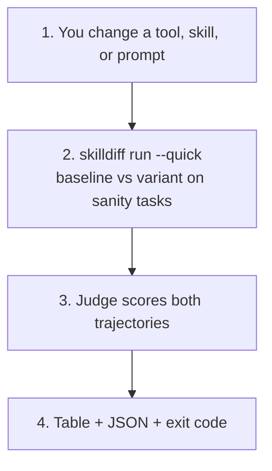
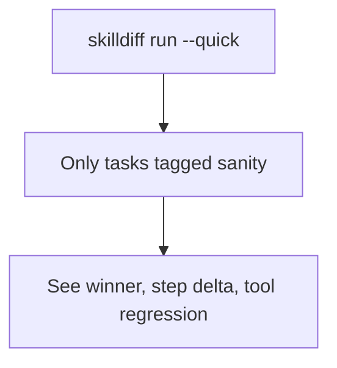
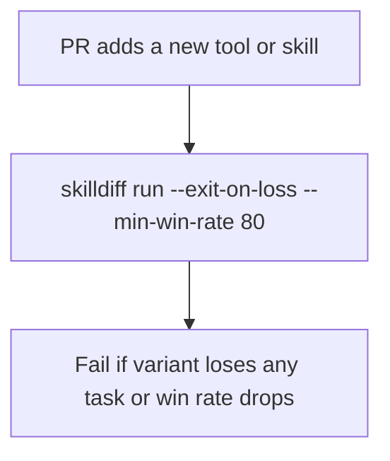
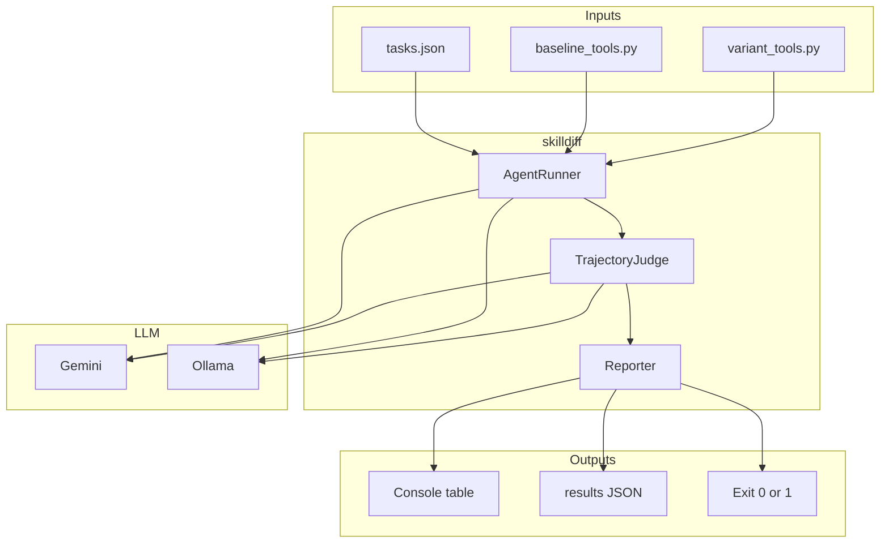

# skilldiff

[](https://github.com/shunvel/skilldiff/actions/workflows/ci.yml?query=branch%3Amain)
[](https://pypi.org/project/skilldiff/)
[](https://pypi.org/project/skilldiff/)
[](LICENSE)

Adding a tool, rewriting a skill, or swapping a system prompt is cheap. Knowing whether the agent got *better* is not. Offline evals score a final answer. They miss the trajectory: extra tool hops, silent regressions, and “it still printed the right string” failures.

**skilldiff** is a weigh-in for agent changes. Run baseline vs. variant on the same tasks. An LLM-as-a-Judge scores both traces, flags tool regressions, and writes a JSON diff an IDE agent can patch against.

```bash
pip install skilldiff
skilldiff demo
```

- **A/B agent runs** — same `tasks.json`, two tool/skill scripts, concurrent trajectories.
- **LLM-as-a-Judge** — Gemini (cloud) or Ollama (local). JSON verdicts, not vibes.
- **Shift-left** — `skilldiff run --quick` on `sanity` tags for a sub-minute inner loop.
- **CI gate** — `--exit-on-loss` / `--min-win-rate` fail the PR when the variant regresses.
- **Machine-readable diffs** — `.agent_diff/results_<timestamp>.json` with `fix_suggestion` for Cursor / Claude Code.

## Why this exists

Agentic coding workflows keep changing *how* the model acts: new tools, MCP servers, skills, prompt fragments. Teams then ship those changes because a handful of chat sessions “looked fine.”

That is the evals gap:

| What typical evals measure | What agent changes actually break |
|----------------------------|-----------------------------------|
| Final answer vs. gold label | Tool choice, argument quality, extra hops |
| Pass@k on a static prompt | Multi-step traces that succeed for the wrong reason |
| Model-vs-model leaderboards | Skill A vs. skill B on *your* tasks |
| Human eyeballing in the IDE | Repeatable CI signal with an exit code |

**skilldiff** treats the agent configuration as the unit under test. The model can stay fixed. You swap tools or skills, record both trajectories, and ask a judge: did the variant complete the job with fewer mistakes, or did it introduce a regression?

It is complementary to [fatcheck](https://github.com/shunvel/fatcheck). fatcheck asks whether instruction files should keep growing. skilldiff asks whether a new skill or tool *earned* its place.

## Demo (no API key)

```
                               skilldiff Results
┏━━━━━━━━━━━━━┳━━━━━━━━━━┳━━━━━━━━━━━━━┳━━━━━━━━━━━━━┳━━━━━━━━━━━━┳━━━━━━━━━━━━┓
┃ Task ID     ┃ Winner   ┃ Baseline    ┃ Variant     ┃ Step Delta ┃ Regression?┃
┡━━━━━━━━━━━━━╇━━━━━━━━━━╇━━━━━━━━━━━━━╇━━━━━━━━━━━━━╇━━━━━━━━━━━━╇━━━━━━━━━━━━┩
│ fetch_page… │ variant  │         7.5 │         8.8 │          0 │     No     │
│ summarize_… │ variant  │         6.0 │         9.0 │         -1 │     No     │
└─────────────┴──────────┴─────────────┴─────────────┴────────────┴────────────┘
╭────────────────────────────────── Summary ───────────────────────────────────╮
│ Total Tasks: 2  ·  Variant Wins: 2  ·  Losses: 0  ·  Ties: 0  ·  Win Rate: 100.0% │
╰──────────────────────────────────────────────────────────────────────────────╯
Saved results to .agent_diff/results_<timestamp>.json
```

```bash
skilldiff demo
```

Mock agents, same table and JSON shape as a live run. Use this to confirm the CLI is installed.

## How it works

skilldiff does not train a model. It diffs two agent configurations on a frozen task suite.



**Inner loop (local)**



**Outer loop (CI)**



Judge guards (so the score is not just “whoever spoke last”):

- **Short-circuit** — identical `final_output` and step count → tie, no LLM call.
- **Score parity** — `winner=variant` requires `variant_score > baseline_score`.
- **Swap-order** — `--swap-order` re-judges with agents swapped; disagreement → tie.

## Determinism, variance, and cost

The agent loop and the judge are both LLMs. A single run is a **sample**, not a measurement.

| Lever | What it does | What it does not do |
|-------|----------------|---------------------|
| Agent `temperature=0.2` | Reduces tool-call jitter | Guarantee the same trace twice |
| Judge `temperature=0.0` | Makes verdicts stabler | Remove position bias or model drift |
| Short-circuit / score parity / `--swap-order` | Catch empty-run ties and label/score fights | Replace n-run evals |
| `--quick` | Cuts task count (and bill) | Change statistical power |

**Practical policy:** treat `--quick` as a smoke test. For a merge gate, run the full suite (or `fixtures/demo-repo`) more than once if a one-point score swing would flip the winner. `--swap-order` doubles judge calls (and cost). There is no per-token cost field in v0.1 — use the provider dashboard. Do not compare win rates across different judge models.

## Install

Python 3.10+.

```bash
pip install skilldiff
# or: pipx install skilldiff
# or from a clone:
pip install -e ".[dev]"
```

Git fallback: `pip install git+https://github.com/shunvel/skilldiff.git`

Tag `v*` uploads to PyPI via Trusted Publishing ([`.github/workflows/publish.yml`](.github/workflows/publish.yml)).

## Day-one flow

**1. Demo**

```bash
skilldiff demo
```

**2. Cloud (Gemini)**

```bash
cp .env.example .env   # set GEMINI_API_KEY
skilldiff run --quick --provider gemini --model gemini-3.5-flash-lite \
  --tasks fixtures/demo-repo/tasks.json \
  --baseline-tools fixtures/demo-repo/baseline_tools.py \
  --variant-tools fixtures/demo-repo/variant_tools.py
```

Free-tier `gemini-3.5-flash` is capped at 20 requests/day. Use `gemini-3.5-flash-lite` if you hit 429s.

**3. Local (Ollama, 16 GB RAM)**

```bash
# https://ollama.com/download
ollama serve
ollama pull qwen3:8b
skilldiff run --quick --provider ollama --model qwen3:8b \
  --tasks fixtures/demo-repo/tasks.json \
  --baseline-tools fixtures/demo-repo/baseline_tools.py \
  --variant-tools fixtures/demo-repo/variant_tools.py
```

| Model | RAM (approx.) | Notes |
|-------|---------------|-------|
| `qwen3:8b` | ~6 GB | Default. Best local balance for tool calling. |
| `qwen3:4b` | ~3 GB | Faster, weaker tools. |
| `qwen3:27b` | ~18 GB+ | Too large for 16 GB machines. |

If Ollama is not running, both agents fail the same way and the judge short-circuits to a 5.0/5.0 tie. That is a setup miss, not a real comparison.

**4. CI gate**

```bash
skilldiff run --quick --provider gemini --model gemini-3.5-flash-lite \
  --tasks fixtures/demo-repo/tasks.json \
  --baseline-tools fixtures/demo-repo/baseline_tools.py \
  --variant-tools fixtures/demo-repo/variant_tools.py \
  --exit-on-loss --min-win-rate 80
```

Store `GEMINI_API_KEY` as a CI secret. Never commit `.env`.

## CLI

### `skilldiff run`

| Flag | Default | Description |
|------|---------|-------------|
| `--tasks` | `tasks.json` | Task suite JSON |
| `--quick` | off | Only tasks tagged `sanity` |
| `--baseline-tools` | required | Python script of baseline tools |
| `--variant-tools` | required | Python script of variant tools |
| `--provider` | `gemini` | `gemini` or `ollama` |
| `--model` | provider default | e.g. `gemini-3.5-flash-lite`, `qwen3:8b` |
| `--ollama-host` | `http://localhost:11434` | Ollama URL |
| `--exit-on-loss` | off | Exit 1 if variant loses any task |
| `--min-win-rate` | none | Exit 1 if win rate is below this |
| `--output-dir` | `.agent_diff` | JSON results directory |
| `--swap-order` | off | Second judge pass to reduce position bias |

### `skilldiff demo`

Mock trajectories. No key, no Ollama.

## Tasks and tools

The reviewable suite lives in [`fixtures/demo-repo/`](fixtures/demo-repo/) (four tasks: two `sanity`, two `eval`). Root `examples/` + `tasks.json` are the shorter day-one copy.

`tasks.json`:

```json
[
  {
    "id": "fetch_page_title",
    "prompt": "Fetch the title of https://example.com",
    "expected_outcome": "Returns 'Example Domain'",
    "tags": ["sanity"]
  }
]
```

Tool scripts expose public functions (no leading `_`). Names, docstrings, and type hints become tool declarations.

- Baseline: [`fixtures/demo-repo/baseline_tools.py`](fixtures/demo-repo/baseline_tools.py)
- Variant: [`fixtures/demo-repo/variant_tools.py`](fixtures/demo-repo/variant_tools.py)

## JSON output

Written to `.agent_diff/results_<timestamp>.json`:

```json
{
  "summary": {
    "total_tasks": 2,
    "variant_wins": 1,
    "variant_losses": 1,
    "ties": 0,
    "win_rate_pct": 50.0
  },
  "results": [
    {
      "task_id": "fetch_page_title",
      "verdict": {
        "winner": "variant",
        "baseline_score": 9.0,
        "variant_score": 10.0,
        "tool_regression_detected": false,
        "fix_suggestion": null
      },
      "step_delta": -1
    }
  ]
}
```

When the variant loses, `fix_suggestion` is meant for an IDE agent to apply. Do not commit `.agent_diff/` — traces can contain prompts and observations.

## Architecture



| Module | Role |
|--------|------|
| `skilldiff/main.py` | CLI, env, CI flags |
| `skilldiff/models.py` | Pydantic task / trajectory / verdict schemas |
| `skilldiff/tools_schema.py` | Dynamic import of user tool scripts |
| `skilldiff/agent_runner.py` | Concurrent baseline vs. variant loops |
| `skilldiff/llm.py` | Gemini + Ollama backends |
| `skilldiff/judge.py` | Short-circuit, parity, swap-order |
| `skilldiff/reporter.py` | Rich table, JSON, exit decision |

## Honest limits

- This is **v0.1**. Not a replacement for [Inspect](https://inspect.aisi.org.uk/), [Promptfoo](https://www.promptfoo.dev/), or a full eval harness.
- The judge is an LLM. Guards reduce bias; they do not eliminate variance. See [Determinism](#determinism-variance-and-cost).
- A 5.0/5.0 tie with empty trajectories usually means the provider failed (quota, Ollama down), not that the variant is equal.
- [`fixtures/demo-repo/`](fixtures/demo-repo/) is a demo suite, not your product eval set.
- Gemini 3.x requires preserving thought signatures across tool turns. skilldiff does this; rolling your own history by hand will 400.
- Local Qwen on 16 GB RAM should stay at `qwen3:8b` or smaller.

## Security

Never commit secrets. [`.gitignore`](.gitignore) excludes `.env`, `.env.*` (keeps `.env.example`), `.agent_diff/`, `*.pem`, `*.key`, and cloud credential JSON.

Copy [`.env.example`](.env.example) → `.env` locally. If a key is committed, rotate it in [Google AI Studio](https://aistudio.google.com/apikey) and purge git history. See [SECURITY.md](SECURITY.md).

## Development

```bash
pip install -e ".[dev]"
ruff check skilldiff tests examples fixtures
mypy
pytest -v
skilldiff demo
```

CI matrix: Python 3.10–3.13 plus ruff/mypy ([`.github/workflows/ci.yml`](.github/workflows/ci.yml)). Dependabot updates pip and GitHub Actions weekly. See [CONTRIBUTING.md](CONTRIBUTING.md).

## License

[MIT](LICENSE) © 2026 shunvel
