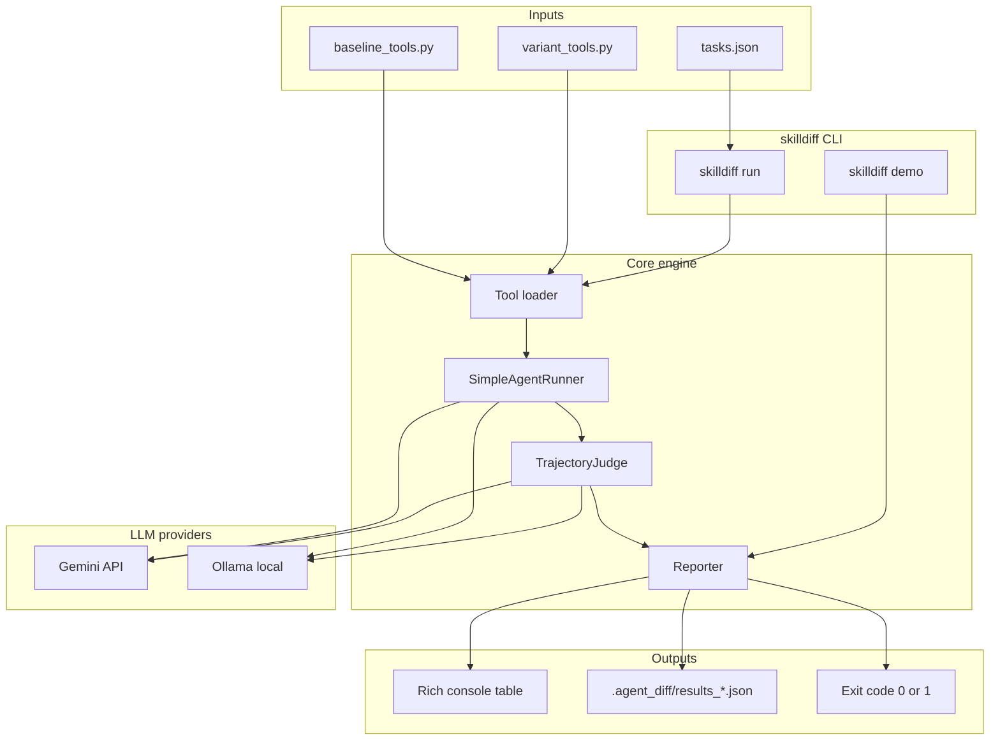
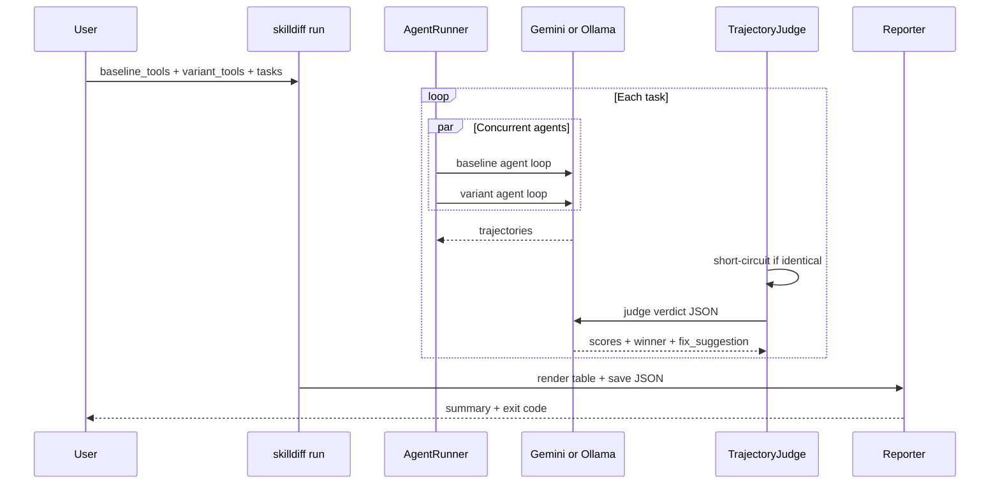

# skilldiff

[](https://github.com/shunvel/skilldiff/actions/workflows/ci.yml)
[](https://www.python.org/downloads/)
[](LICENSE)

**skilldiff** is a production-grade Python CLI for A/B testing AI agent skills, prompts, and tool definitions. It runs baseline vs. variant agents on a shared task suite and uses an LLM-as-a-Judge to score trajectories, detect tool regressions, and emit machine-readable diffs for auto-patching in Cursor or Claude Code.

Supports **Gemini (cloud)** and **Ollama (local)** providers.

---

## Table of contents

- [Architecture](#architecture)
- [Repository structure](#repository-structure)
- [Install](#install)
- [Quick start](#quick-start)
- [Validation checklist](#validation-checklist)
- [CLI reference](#cli-reference)
- [Task and tool format](#task-and-tool-format)
- [JSON output](#json-output)
- [CI integration](#ci-integration)
- [Development](#development)
- [Security](#security)
- [License](#license)

---

## Architecture



### Execution flow



| Component | Module | Responsibility |
|-----------|--------|----------------|
| CLI | `skilldiff/main.py` | Typer commands, env loading, CI flags |
| Models | `skilldiff/models.py` | Pydantic schemas for tasks, trajectories, verdicts |
| Tool loader | `skilldiff/tools_schema.py` | Dynamic import of user `.py` tool scripts |
| Agent runner | `skilldiff/agent_runner.py` | Async agent loop, concurrent baseline/variant |
| LLM backends | `skilldiff/llm.py` | Gemini and Ollama provider abstraction |
| Judge | `skilldiff/judge.py` | LLM-as-a-Judge with bias guards |
| Reporter | `skilldiff/reporter.py` | Rich tables, JSON export, exit decisions |

---

## Repository structure

```
skilldiff/
├── .env.example              # Template for GEMINI_API_KEY (never commit .env)
├── .github/workflows/ci.yml  # Python 3.10–3.12 test matrix
├── .gitignore                # Ignores .env, .agent_diff/, caches
├── LICENSE                   # MIT
├── README.md
├── pyproject.toml            # Hatchling package + CLI entrypoint
├── tasks.json                # Default sanity task suite
├── notes.txt                 # Sample file for summarize task
├── examples/
│   ├── baseline_tools.py     # Baseline agent tools
│   ├── variant_tools.py      # Variant agent tools
│   └── http_utils.py         # macOS-safe HTTPS helper
├── skilldiff/                # Installable Python package
│   ├── __init__.py
│   ├── main.py               # CLI entrypoint
│   ├── models.py
│   ├── tools_schema.py
│   ├── agent_runner.py
│   ├── llm.py
│   ├── judge.py
│   └── reporter.py
└── tests/                    # pytest suite (30 tests)
    ├── test_models.py
    ├── test_judge.py
    ├── test_reporter.py
    ├── test_agent_runner.py
    ├── test_cli.py
    ├── test_llm.py
    ├── test_gemini_history.py
    └── test_http_utils.py
```

---

## Install

**Requirements:** Python 3.10+

```bash
# From PyPI (when published)
pip install skilldiff

# From GitHub
pip install git+https://github.com/shunvel/skilldiff.git

# Editable dev install
git clone https://github.com/shunvel/skilldiff.git
cd skilldiff
pip install -e ".[dev]"
```

---

## Quick start

### 1. Zero-config demo (no API key)

```bash
skilldiff demo
```

Prints a Rich results table and writes JSON to `.agent_diff/results_<timestamp>.json`.

### 2. Cloud run (Gemini)

```bash
cp .env.example .env
# Edit .env and set GEMINI_API_KEY=your_key_here

skilldiff run \
  --quick \
  --provider gemini \
  --model gemini-3.5-flash-lite \
  --baseline-tools examples/baseline_tools.py \
  --variant-tools examples/variant_tools.py
```

> **Note:** Free-tier `gemini-3.5-flash` has a 20 req/day limit. Use `gemini-3.5-flash-lite` if you hit quota errors.

### 3. Local run (Ollama + Qwen)

```bash
# Install Ollama: https://ollama.com/download
curl -fsSL https://ollama.com/install.sh | sh   # or download Ollama.dmg

ollama serve          # keep running in a separate terminal
ollama pull qwen3:8b  # recommended for 16 GB RAM

skilldiff run \
  --quick \
  --provider ollama \
  --model qwen3:8b \
  --baseline-tools examples/baseline_tools.py \
  --variant-tools examples/variant_tools.py
```

#### Local model sizing (16 GB RAM)

| Model | RAM (approx.) | Recommendation |
|-------|---------------|----------------|
| `qwen3:8b` | ~6 GB | **Default** — best balance for tool calling |
| `qwen3:4b` | ~3 GB | Faster, lighter |
| `qwen3:27b` | ~18 GB+ | **Too large** for 16 GB systems |

---

## Validation checklist

Use this checklist to confirm skilldiff is working before sharing or integrating into CI.

### Step 1 — Install and import

```bash
pip install -e ".[dev]"
python -c "import skilldiff; print(skilldiff.__version__)"
skilldiff --help
```

**Expected:** Version prints, help shows `run` and `demo` commands.

### Step 2 — Unit tests (offline)

```bash
pytest -v
```

**Expected:** All tests pass (currently 30). No API key required.

### Step 3 — Demo smoke test

```bash
skilldiff demo
echo $?    # should print 0
ls .agent_diff/results_*.json
```

**Expected:** Rich table with 2 tasks, exit code `0`, JSON file created.

### Step 4 — Tool loading

```bash
python -c "
from pathlib import Path
from skilldiff.tools_schema import load_tools_from_script, build_tool_specs
b = load_tools_from_script(Path('examples/baseline_tools.py'))
v = load_tools_from_script(Path('examples/variant_tools.py'))
assert 'fetch_url' in b and 'fetch_and_extract_title' in v
print('tool loading OK')
"
```

**Expected:** `tool loading OK`

### Step 5 — Live A/B run (Gemini)

```bash
cp .env.example .env   # set GEMINI_API_KEY
skilldiff run --quick --provider gemini --model gemini-3.5-flash-lite \
  --baseline-tools examples/baseline_tools.py \
  --variant-tools examples/variant_tools.py
```

**Expected:**

- Rich table with winners, scores, step deltas
- JSON saved under `.agent_diff/`
- Multi-step trajectories (not instant 5.0/5.0 ties from errors)
- Exit code `0` unless `--exit-on-loss` triggers

### Step 6 — Live A/B run (Ollama, optional)

```bash
curl -s http://localhost:11434/api/tags   # Ollama must be running
skilldiff run --quick --provider ollama --model qwen3:8b \
  --baseline-tools examples/baseline_tools.py \
  --variant-tools examples/variant_tools.py
```

**Expected:** Same as Step 5. If Ollama is not running, both agents fail identically and the judge short-circuits to tie — that indicates a setup problem, not a successful comparison.

### Step 7 — CI gate flags

```bash
skilldiff run --quick --provider gemini --model gemini-3.5-flash-lite \
  --baseline-tools examples/baseline_tools.py \
  --variant-tools examples/variant_tools.py \
  --exit-on-loss --min-win-rate 0
echo $?
```

**Expected:** Exit code `0` when variant win rate meets threshold.

---

## CLI reference

### `skilldiff run`

| Flag | Default | Description |
|------|---------|-------------|
| `--tasks` | `tasks.json` | Task suite JSON path |
| `--quick` | off | Run only tasks tagged `sanity` |
| `--baseline-tools` | required | Python script with baseline tool functions |
| `--variant-tools` | required | Python script with variant tool functions |
| `--provider` | `gemini` | `gemini` (cloud) or `ollama` (local) |
| `--model` | provider default | e.g. `gemini-3.5-flash-lite`, `qwen3:8b` |
| `--ollama-host` | `http://localhost:11434` | Ollama server URL |
| `--exit-on-loss` | off | Exit code 1 if variant loses any task |
| `--min-win-rate` | none | Exit code 1 if win rate is below threshold |
| `--output-dir` | `.agent_diff` | JSON results directory |
| `--swap-order` | off | Swapped-order judge pass to reduce position bias |

### `skilldiff demo`

Runs mock trajectories and verdicts. No API key or Ollama required.

---

## Task and tool format

### `tasks.json`

```json
[
  {
    "id": "fetch_page_title",
    "prompt": "Fetch the title of https://example.com",
    "expected_outcome": "Returns 'Example Domain'",
    "tags": ["sanity"]
  }
]
```

### Tool scripts

Each `--*-tools` file exposes public functions (no leading `_`). Names, docstrings, and type hints become LLM tool declarations.

- Baseline: [`examples/baseline_tools.py`](examples/baseline_tools.py)
- Variant: [`examples/variant_tools.py`](examples/variant_tools.py)

---

## JSON output

Results are written to `.agent_diff/results_<timestamp>.json`:

```json
{
  "timestamp": "2026-08-17T06:25:19Z",
  "summary": {
    "total_tasks": 2,
    "variant_wins": 1,
    "variant_losses": 1,
    "ties": 0,
    "win_rate_pct": 50.0
  },
  "results": [
    {
      "task_id": "fetch_page_title",
      "baseline_trajectory": { "steps": [], "final_output": "..." },
      "variant_trajectory": { "steps": [], "final_output": "..." },
      "verdict": {
        "winner": "variant",
        "baseline_score": 9.0,
        "variant_score": 10.0,
        "reasoning": "...",
        "tool_regression_detected": false,
        "fix_suggestion": null
      },
      "step_delta": -1
    }
  ]
}
```

Feed this file to Cursor or Claude Code for automated patching when `fix_suggestion` is present.

---

## CI integration

GitHub Actions runs on Python 3.10, 3.11, and 3.12 — see [`.github/workflows/ci.yml`](.github/workflows/ci.yml).

Example gate in your pipeline:

```bash
skilldiff run \
  --quick \
  --provider gemini \
  --model gemini-3.5-flash-lite \
  --baseline-tools examples/baseline_tools.py \
  --variant-tools examples/variant_tools.py \
  --exit-on-loss \
  --min-win-rate 80
```

Store `GEMINI_API_KEY` as a CI secret — never commit it.

---

## Development

```bash
pip install -e ".[dev]"
pytest -v
skilldiff demo
```

---

## Security

**Never commit secrets.** This repo's [`.gitignore`](.gitignore) excludes:

| Pattern | Reason |
|---------|--------|
| `.env`, `.env.*` | API keys and local config |
| `.agent_diff/` | Run artifacts may contain prompts and trajectories |
| `*.pem`, `*.key`, `secrets/` | Credentials |
| `credentials.json`, `service-account*.json` | Cloud credentials |

Use [`.env.example`](.env.example) as the template. Copy to `.env` locally only.

If a key is accidentally committed, rotate it immediately in [Google AI Studio](https://aistudio.google.com/apikey) and purge it from git history.

---

## License

MIT — see [LICENSE](LICENSE).
